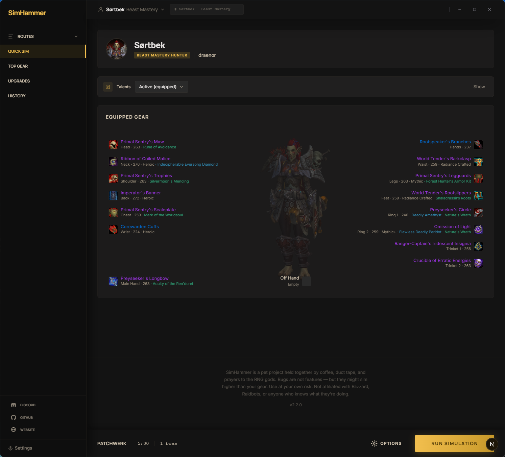
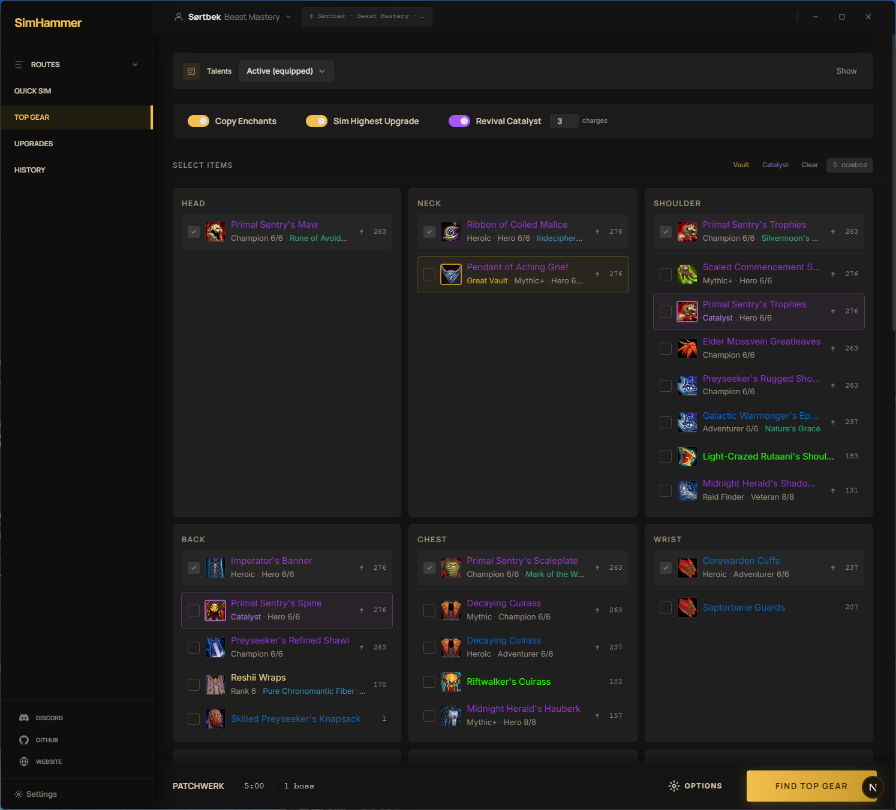
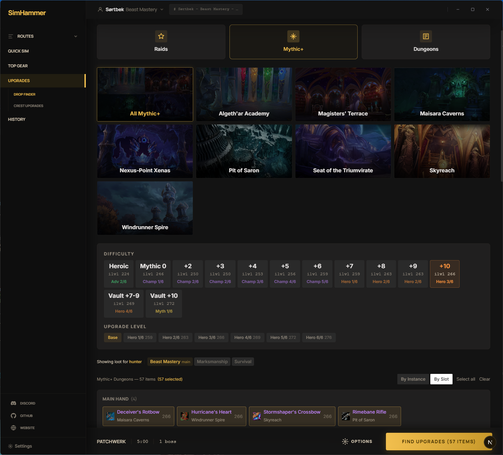
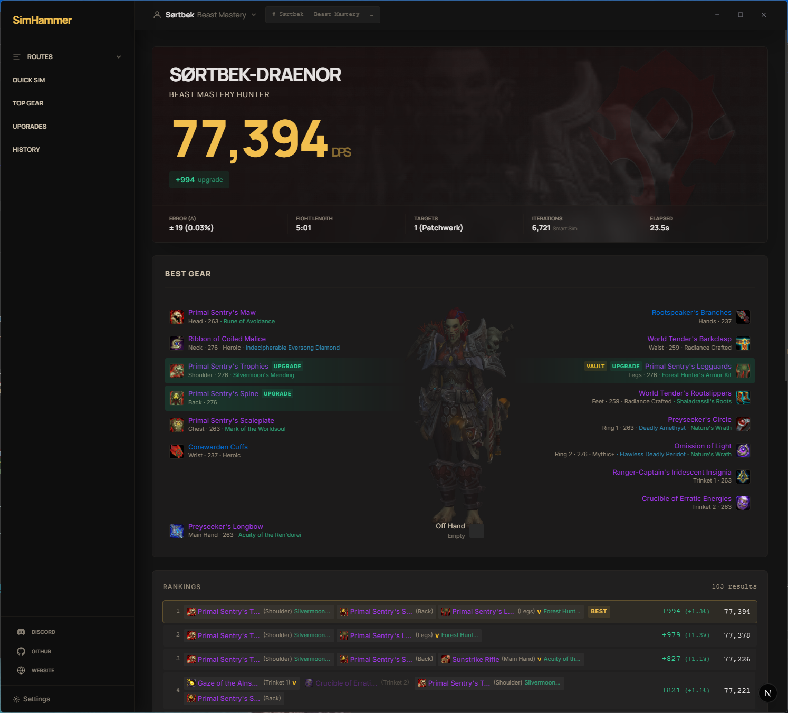
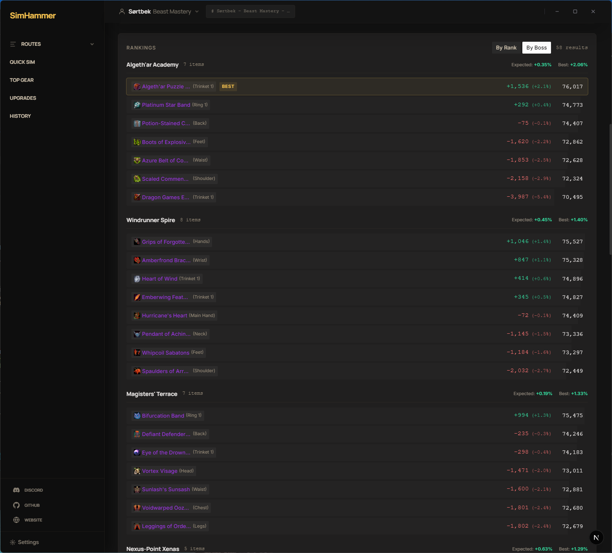
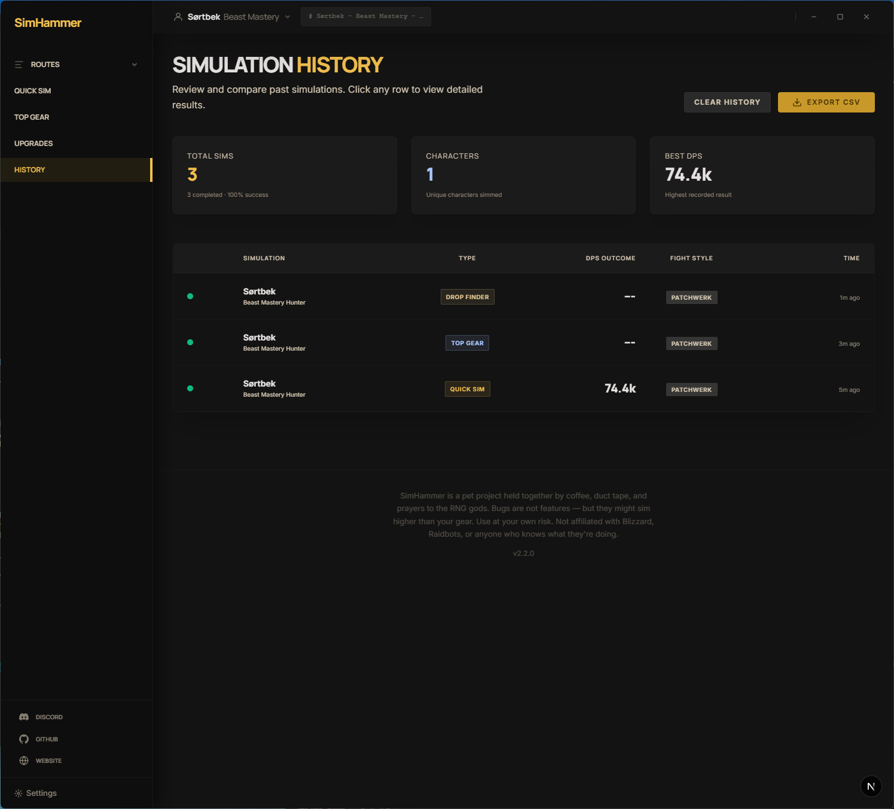

# SimHammer

SimulationCraft made simple. Run sims from your browser or download the desktop app — no command line needed.

**[Try the Demo](https://simhammer.com)** · **[Download Desktop App](https://github.com/sortbek/simcraft/releases/latest)** · **[Documentation](docs/)**

---

<p align="center">
  
  
  
</p>
<p align="center">
  
  
  
</p>

## Sim Types

| | Description |
|---|---|
| **Quick Sim** | DPS, ability breakdown, and stat weights |
| **Top Gear** | Find the best gear combination from your bags and vault |
| **Drop Finder** | Sim raid and dungeon loot to find upgrades |
| **Crest Upgrades** | Find the best Dawncrest upgrade path within your budget |

## Quick Start

### Desktop

Download the installer from [Releases](https://github.com/sortbek/simcraft/releases/latest). Available for Windows, macOS, and Linux. Runs locally using all CPU cores.

### Self-Host with Docker

```bash
docker run -p 8000:8000 \
  -v simhammer-data:/app/resources/data \
  -v simhammer-data-full:/app/resources/data_full \
  -v simhammer-simc:/app/resources/simc \
  -v simhammer-db:/app/db \
  ghcr.io/sortbek/simcraft:latest
```

Visit **http://localhost:8000** — single container, batteries included.

## Documentation

| | |
|---|---|
| **[Architecture](docs/architecture.md)** | System design, storage, deployment modes |
| **[Development](docs/development.md)** | Local setup, web + desktop dev, building |
| **[Self-Hosting](docs/self-hosting.md)** | Docker, PostgreSQL, VPS deploy, environment variables |
| **[Contributing](CONTRIBUTING.md)** | Code style, PRs, CI pipeline |

## License

Private repository. All rights reserved.
